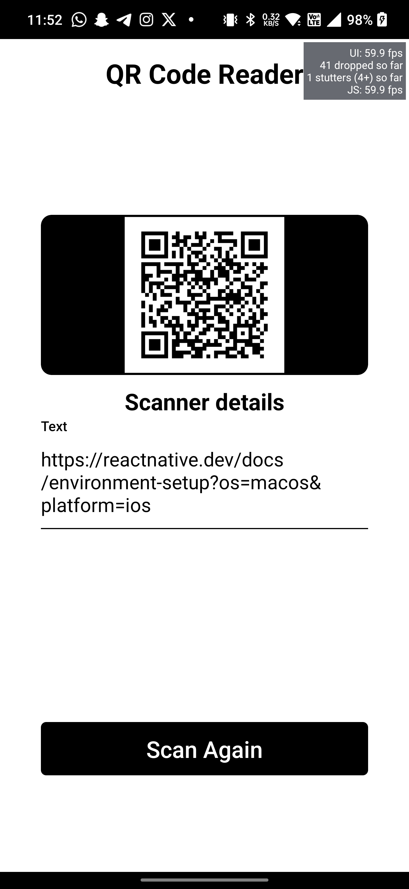

# QR Code Scanner Application

This application allows users to scan QR codes using their device's camera. It is built with React Native for the frontend and a custom native Android module for QR code scanning using the ZXing library.

## Features

- Scan QR codes using the device's camera
- Display scanned QR code data and image
- Copy scanned data to clipboard

## Installation

### Prerequisites

- Node.js
- npm or yarn
- React Native development environment setup
- Android SDK and Android Studio

### Instructions

1. Clone the repository:

```bash
git clone https://github.com/HammadAhm3d/qrReader
```

2. Navigate to the project directory:

```bash
cd qrReader
```

3. Install dependencies:

```bash
npm install
```

4. Start the Metro bundler:

```bash
npx react-native start
```

5. Run the application on an Android device or emulator:

```bash
npx react-native run-android
```

## Usage

1. Launch the application on your Android device or emulator.
2. Tap the "Scan QR Code" button to open the scanner.
3. Point the camera at a QR code to scan it.
4. Once the QR code is scanned, the data and image will be displayed.
5. Long-press on the scanned data to copy it to the clipboard.

## Native Android Module

The QR code scanning functionality is implemented using a native Android module, which bridges the React Native JavaScript code with native Android code. The module uses the ZXing library to perform QR code scanning.

### Module Files

- **QRScannerModule.kt**: Kotlin file containing the implementation of the native module for QR code scanning.
- **QRScannerPackage.kt**: Kotlin file defining the package for the native module.
- **CustomScannerActivity.kt**: Kotlin file defining the custom activity for scanning QR codes with custom UI.
- **App.tsx**: TypeScript file containing the React Native application code, including the usage of the native module for QR code scanning.

### Demo


## Performance Metrics

### Memory and Battery Consumption

ZXing library is renowned for its efficiency in memory and battery consumption, making it an ideal choice for QR code scanning. Despite the demanding nature of real-time camera processing, the QR Scanner module has been optimized to minimize resource usage while ensuring smooth performance.

### Battery Consumption

While reliable battery consumption metrics were not readily available, observation of the Android device's battery usage did not indicate any strain caused by the QR Scanner module.

### Frame Rate

The performance monitor from the React Native application consistently shows a frame rate of around 60 frames per second (FPS). This indicates that the application runs smoothly without any noticeable stuttering, contributing to a seamless user experience.



# QR Code Scanning Roadmap for iOS

Hey there! 👋 While I've successfully implemented QR code scanning functionality for Android using the ZXing library in Kotlin, I'm currently unable to provide the same for iOS due to the lack of necessary equipment and tools. However, I'm planning to tackle this challenge in the future and ensure that QR code scanning is available across both Android and iOS platforms in our React Native application.

## iOS Implementation (Planned)

### 1. Setup Development Environment

- Acquire access to a macOS device with Xcode installed for iOS development.
- Set up a new iOS native module within the React Native project using the React Native CLI.

### 2. Implement QR Code Scanning Functionality

I am looking at two possible approaches here.

- **AVFoundation Approach:**

  - Utilize AVFoundation framework to access the device's camera and capture video frames.
  - Implement real-time QR code detection by analyzing video frames using AVFoundation's AVCaptureSession and AVCaptureVideoDataOutput.
  - Use AVCaptureMetadataOutput to identify QR codes within captured frames.
  - Extract QR code data from metadata objects and handle successful scans.

- **Core Image Approach:**
  - Explore Core Image framework for image processing capabilities.
  - Implement QR code detection using Core Image's CIDetector.
  - Configure CIDetector to recognize QR codes within static images or video frames.
  - Extract QR code data from detected features and handle successful scans.

### 3. Bridge Native Module with React Native

- Implement a bridge between the native iOS module and React Native JavaScript using the React Native bridging mechanism. I will probably use the similar Callback mechanism that I used for Android or maybe switch to an eventEmitter technique. I will have to think about it.
- Define methods in the native module to initiate QR code scanning and handle scanned data.

## Collaboration Opportunity 🤝

I'm open to collaboration with fellow BeanBakers who might have expertise in iOS development and are interested in contributing to this project. If you're passionate about mobile development and want to help bring QR code scanning functionality to our React Native app on iOS, feel free to reach out! Together, we can make it happen.

---

That's the plan! I'm excited about the possibility of expanding our app's capabilities to iOS and collaborating with others to achieve this goal. Let's make our app even better together! 🚀

### Excited!!


## Credits

- [React Native](https://reactnative.dev/) - JavaScript framework for building mobile applications.
- [ZXing](https://github.com/zxing/zxing) - Library for QR code scanning and generation.
- [JourneyApps BarcodeScanner](https://github.com/journeyapps/zxing-android-embedded) - Embedded version of ZXing library for Android.
